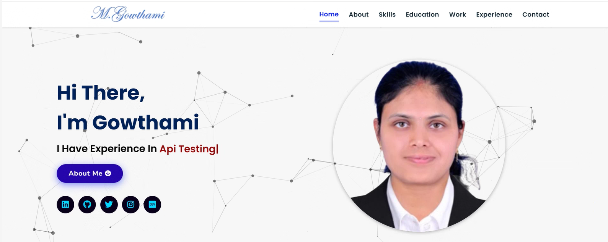

# My_Portfolio_Website
Explore my single-page portfolio, where software testing expertise meets excellence. As a Full Stack QA Tester, I ensure top-quality products using Selenium, TestCafe, and API testing. Let's connect and elevate your software testing journey.

# Gowthami Portfolio

Welcome to my single-page portfolio website! This repository contains the code for my personal portfolio site, showcasing my skills, experience, and projects as a Full Stack QA Tester.

## Live Demo

Explore my portfolio: [https://iamgowthamis.netlify.app/](https://iamgowthamis.netlify.app/)

## Table of Contents

- [About Me](#about-me)
- [Skills](#skills)
- [Education](#education)
- [Work Experience](#work)
- [Contact](#contact)
- [Quick Links](#quick-links)
- [License](#license)

## About Me

I'm Gowthami, a dynamic QA Software Tester with a strong track record of delivering high-quality products. My expertise lies in testing methodologies, defect identification, and continuous improvement. I'm dedicated to excellence and committed to making a positive impact.

## Skills

Explore my technical skills, which include:

- Selenium
- Java
- TestCafe
- BrowserStack
- DB Testing
- API Testing
- GCP
- Jenkins
- Android
- Bootstrap
- HTML5
- CSS3
- JavaScript
- Jira
- MySQL
- GitHub
- Git VCS
- MS Office

## Education

I've pursued a Bachelor of Technology in Information Technology and have completed my education at renowned institutions.

---

Thank you for exploring my personal portfolio website. Connect with me on social media and let's elevate your goals together!
